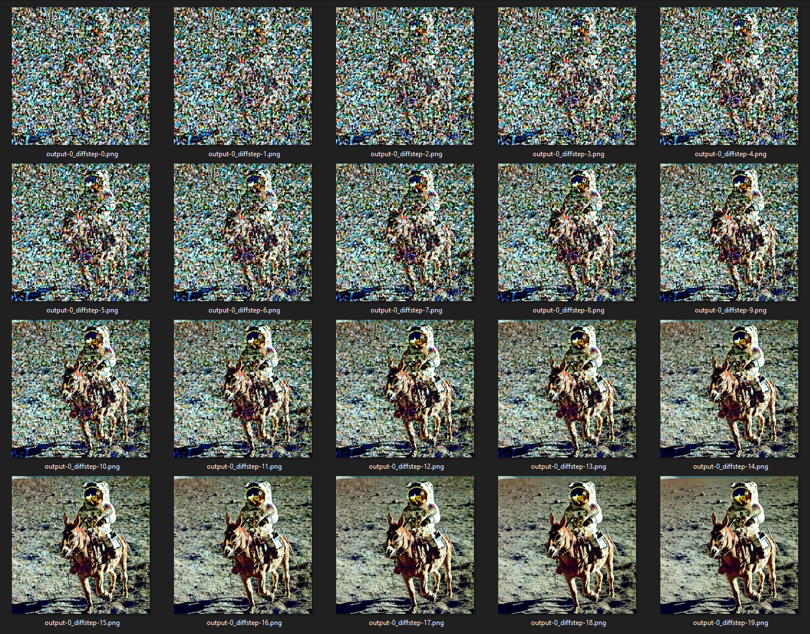

# Stable-Diffusion-Latent-Space-Explorer

## General Information


**Advisors:**
* [Prof. Dr. Visvanathan Ramesh](http://www.ccc.cs.uni-frankfurt.de/people/), email: V.Ramesh@em.uni-frankfurt.de

**Institutions:**
  * **[Goethe University](http://www.informatik.uni-frankfurt.de/index.php/en/)**
  * **[AISEL - AI Systems Engineering Lab](http://www.ccc.cs.uni-frankfurt.de/)**

**Project team (A-Z):**
* Alen Smajic

## Setup
### Installation
1. Clone this repository.

       git clone https://github.com/alen-smajic/Stable-Diffusion-Latent-Space-Explorer
       
2. Create a virtual environment.

       python -m venv venv
       
2. Install PyTorch with CUDA ([follow this PyTorch installation](https://pytorch.org/get-started/locally/)).
       
3. Install [diffusers](https://huggingface.co/docs/diffusers/index) and [transformers](https://huggingface.co/docs/transformers/index) librariers.

       pip install diffusers["torch"] transformers
       
4. Optional: Install [xFormers](https://github.com/facebookresearch/xformers) for efficient attention.

       pip install xformers
       
### Model Weights
You can download the model weights using [git-lfs](https://git-lfs.com/).

        git lfs install
        git clone https://huggingface.co/stabilityai/stable-diffusion-2-1
        
The command above will create a local folder called ```./stable-diffusion-2-1``` on your disk.

The code in this repo was tested on: 

:heavy_check_mark: [Stable Diffusion 2.1](https://huggingface.co/stabilityai/stable-diffusion-2-1)

:heavy_check_mark: [Stable Diffusion 2.1 base](https://huggingface.co/stabilityai/stable-diffusion-2-1-base)

:heavy_check_mark: [Stable Diffusion 2 Inpainting](https://huggingface.co/stabilityai/stable-diffusion-2-inpainting)

## Instructions
Below is a list of experiments that are currently supported. Each entry is linked to a tutorial of the specified experiment.

### Experiments
1. [Single Inference](#1-single-inference)
2. [Visualize Diffusion](#2-visualize-diffusion)
3. [Interpolation](#3-interpolation)
4. [Diffevolution](#4-diffevolution)
5. [Random Walk](#5-random-walk)

In order to run an experiment, you first need to define the experiment parameters using one of the configuration files. Once this is done, you can run an experiment by calling the following script:

        python --exp_config ./configs/experiments/{path to your config} run_sd_experiment.py
        
The script ```run_sd_experiment.py``` expects an argument ```--exp_config```, which is the path to an experiment configuration file (e.g. ```./configs/experiments/txt2img/single_inference.yaml```)

## Tutorials
### 1. Single Inference
In this tutorial we will use the ```single_inference.yaml``` configuration file for ```txt2img``` (you can find it [here](https://github.com/alen-smajic/Stable-Diffusion-Latent-Space-Explorer/blob/main/configs/experiments/txt2img/single_inference.yaml)). We will generate 5 images that adhere to a prompt describing an astronaut riding a horse on the moon.

:information_source: You can find more information on schedulers [here](https://huggingface.co/docs/diffusers/using-diffusers/schedulers). Morover, if you are unfamiliar with any concept from the ```Model Configurations``` you can refer to the [diffusers documentation](https://huggingface.co/docs/diffusers/index).

#### Prompt Configurations

:keyboard: ```prompt```: *"A photograph of an astronaut riding a horse on the moon."*, ```negative prompt```: *"black and white, blurry, painting, drawing"*

#### Latent Noise Configuration

:seedling: ```rand_seed```: 0, ```height```: 768, ```width```: 768, ```images per prompt```: 5


:information_source: Note that your results may differ from the ones presented here, even with identical configurations and random seeds. 

You can find [here](https://huggingface.co/docs/diffusers/using-diffusers/reproducibility) more information on reproducibility.


### 2. Visualize Diffusion
In this tutorial we will use the ```visualize_diffusion.yaml``` configuration file for ```img2img``` (you can find it [here](https://github.com/alen-smajic/Stable-Diffusion-Latent-Space-Explorer/blob/main/configs/experiments/img2img/visualize_diffusion.yaml)). We will visualize each difusion step of Stable Diffusion's img2img model for the input image ```output-3_diffsteps-25.png``` from [1. Single Inference](#1-single-inference), guided by a new prompt, which describes an astronaut riding a donkey instead of a horse.

#### Prompt Configurations

:keyboard: ```prompt```: *"A photograph of an astronaut riding a donkey on the moon."*, ```negative prompt```: *"black and white, blurry, painting, drawing"*

#### Latent Noise & Image Configuration

:seedling: ```rand_seed```: 42, ```height```: 768, ```width```: 768, ```images per prompt```: 1

:framed_picture: ```image```: {Path to the images folder generated by experiment [1. Single Inference](#1-single-inference)}/output-3_diffstep-25.png, ```strength```: 0.8

<div style="display: flex;">
  
  
</div>
:information_source: Note that the strength parameter scales the specified amount of diffusion steps. That is the reason why the output folder only contains 20 images (for 20 diffusion steps) even though we specified 25 diffusion steps in the config file. It starts the diffusion process from step 5.

### 3. Interpolation
### 4. Diffevolution
### 5. Random Walk
