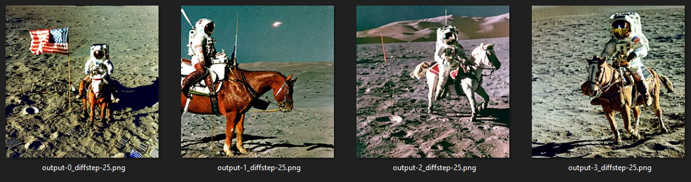

# Stable-Diffusion-Latent-Space-Explorer


## General Information


**Author:**
* Alen Smajic

**Advisor:**
* [Prof. Dr. Visvanathan Ramesh](http://www.ccc.cs.uni-frankfurt.de/people/), email: V.Ramesh@em.uni-frankfurt.de

**Institutions:**
  * **[Goethe University](http://www.informatik.uni-frankfurt.de/index.php/en/)**
  * **[AISEL - AI Systems Engineering Lab](http://www.ccc.cs.uni-frankfurt.de/)**


## Setup
### Installation
1. Clone this repository.

       git clone https://github.com/alen-smajic/Stable-Diffusion-Latent-Space-Explorer
       
2. Create a virtual environment and activate it.

       python -m venv venv
       
3. Install PyTorch with CUDA ([follow this PyTorch installation](https://pytorch.org/get-started/locally/)).
       
4. Install [diffusers](https://huggingface.co/docs/diffusers/index) and [transformers](https://huggingface.co/docs/transformers/index) librariers.

       pip install diffusers["torch"] transformers
       
5. Optional: Install [xFormers](https://github.com/facebookresearch/xformers) for efficient attention.

       pip install xformers
       
### Tested Versions
If you face any issues, you should try to match the version of the installed packages to these versions:

- torch 2.0.0
- cuda 11.8
- diffusers 0.14.0
- xformers 0.0.16
       
### Model Weights
You can download the model weights using [git-lfs](https://git-lfs.com/).

        git lfs install
        git clone https://huggingface.co/stabilityai/stable-diffusion-2-1
        
The command above will create a local folder called ```./stable-diffusion-2-1``` on your disk.

The code in this repo was tested on: 

:heavy_check_mark: [Stable Diffusion 2.1](https://huggingface.co/stabilityai/stable-diffusion-2-1) (native resolution 768x768)

:heavy_check_mark: [Stable Diffusion 2.1 Base](https://huggingface.co/stabilityai/stable-diffusion-2-1-base) (native resolution 512x512)

:heavy_check_mark: [Stable Diffusion 2 Inpainting](https://huggingface.co/stabilityai/stable-diffusion-2-inpainting) (native resolution 512x512)

## Instructions
Below is a list of experiments that are currently supported. Each entry is linked to a tutorial of the specified experiment.

### Experiments
1. [Single Inference](#1-single-inference)
2. [Visualize Diffusion](#2-visualize-diffusion)
3. [Random Walk](#3-random-walk)
4. [Interpolation](#4-interpolation)
5. [Diffevolution](#5-diffevolution)
6. [Outpaint Walk](#6-outpaint-walk)

### How to run an experiment
In order to run an experiment, you first need to define the experiment parameters using one of the experiment configuration files. Once this is done, you can run an experiment by calling the following script:

        python run_sd_experiment.py --exp_config ./configs/experiments/{path to your config} 
        
The script ```run_sd_experiment.py``` expects an argument ```--exp_config```, which is the path to an experiment configuration file (e.g. ```./configs/experiments/txt2img/single_inference.yaml```). 

### Experiment Results

Each experiment run will produce a results folder with a unique name consisting of the date and time of execution, the model identifier and the experiment identifier ([here](https://github.com/alen-smajic/Stable-Diffusion-Latent-Space-Explorer/tree/main/experiments) you can find some exmaples). The subfolders of the results folder include:
 - ```configs``` here will be a copy of the configuration file, which was used to start the experiment.
 - ```images``` stores the images generated by Stable Diffusion.
 - ```embeddings``` stores the unique latents for each generated image. You can reference these files to load the prompt embeddings and latent noise.
  - ```gifs``` stores the gifs generated by the experiment (each frame of the gif is contained within the ```images``` folder). 
  
 ### Some general tips
 :information_source: You can find more information on schedulers [here](https://huggingface.co/docs/diffusers/using-diffusers/schedulers). Morover, if you are unfamiliar with any concept from the ```Model Configurations``` you can refer to the [diffusers documentation](https://huggingface.co/docs/diffusers/index). A great starting point is [this Google Colab Notebook from Hugging Face](https://colab.research.google.com/github/huggingface/notebooks/blob/main/diffusers/stable_diffusion.ipynb), which introduces some of the basic components of Stable Diffusion within the diffusers library.
 
:information_source: As of Stable Diffusion 2.0, you can also specify a negative prompt in addition to the simple (positive) prompt. This negative prompt can be used to eliminate unwanted details like blurry images for example.

:information_source: [Stable Diffusion 2.1](https://huggingface.co/stabilityai/stable-diffusion-2-1) was fine-tuned on images of 768x768 pixels, while [Stable Diffusion 2 Inpainting](https://huggingface.co/stabilityai/stable-diffusion-2-inpainting) was trained on images of 512x512 pixels. You can define custom height and width values within the config file. It is recommended to use the native image resolution in one dimension, and a value larger thant that in the other one. Too high deviations from the native resolution will result in poor quality images.
 

## Tutorials

All experiment runs in this tutorial have the same model configuration. [Stable Diffusion 2.1](https://huggingface.co/stabilityai/stable-diffusion-2-1) was used for ```txt2img``` and ```img2img``` experiments. For ```inpaint``` was [Stable Diffusion 2 Inpainting](https://huggingface.co/stabilityai/stable-diffusion-2-inpainting) used. The most relevant parameters from the model configuration are listed below.

#### Model Configurations

:page_facing_up: 	```scheduler```: DPMSolverMultistepScheduler

:arrows_counterclockwise: ```diffusion_steps```: 25

:control_knobs: ```guidance_scale```: 9.5


### 1. Single Inference
In this tutorial we will use the ```single_inference.yaml``` configuration files for ```txt2img```, ```img2img``` and ```inpaint```. 

### txt2img

We will start by configuring ```txt2img``` to generate 4 images that adhere to a prompt describing an astronaut riding a horse on the moon (you can find the configuration [here](https://github.com/alen-smajic/Stable-Diffusion-Latent-Space-Explorer/blob/main/configs/experiments/txt2img/single_inference.yaml)).

#### Prompt Configurations

:keyboard: ```prompt```: *"A photograph of an astronaut riding a horse on the moon."*, ```negative prompt```: *"black and white, blurry, painting, drawing"*

#### Latent Noise Configuration

:seedling: ```rand_seed```: 0, ```height```: 768, ```width```: 768, ```images per prompt```: 4

| Results |
| --- |
|  |

:information_source: Note that your results may differ from the ones presented here, even with identical configurations and random seeds. 

You can find [here](https://huggingface.co/docs/diffusers/using-diffusers/reproducibility) more information on reproducibility.

### img2img

Next, we will configure ```img2img``` to generate 4 variations of the image ```output-3_diffstep-25.png``` from the previous experiment. The variations will
depict an astronaut riding a donkey on the moon (you can find the configuration [here](https://github.com/alen-smajic/Stable-Diffusion-Latent-Space-Explorer/blob/main/configs/experiments/img2img/single_inference.yaml)).

#### Prompt Configurations

:keyboard: ```prompt```: *"A photograph of an astronaut riding a donkey on the moon."*, ```negative prompt```: *"black and white, blurry, painting, drawing"*

#### Latent Noise & Image Configuration

:seedling: ```rand_seed```: 42, ```height```: 768, ```width```: 768, ```images per prompt```: 4

:framed_picture: ```image```: *"./experiments/2023-03-27_18-43-02_txt2img_single-inference/images/output-3_diffstep-25.png"* 

:mechanical_arm: ```strength```: 0.8

| Results |
| --- |
|  |

 :information_source: Note that the strength parameter scales the specified amount of diffusion steps. Even though we specified 25 diffusion steps in the config file, in actuality Stable Diffusion will start from from diffusion step 5.

### inpaint

Finally, we use ```inpaint``` to generate 4 variations of the image ```output-0_diffstep-25.png``` from the previous experiment, which depicts a donkey instead of a horse. The final 4 variations will be replacing the astronaut with a humanoid roboter using a [manually generated mask](https://github.com/alen-smajic/Stable-Diffusion-Latent-Space-Explorer/blob/main/resources/astronaut_mask.png) (you can find the configuration [here](https://github.com/alen-smajic/Stable-Diffusion-Latent-Space-Explorer/blob/main/configs/experiments/inpaint/single_inference.yaml)).

#### Prompt Configurations

:keyboard: ```prompt```: *"A humanoid roboter astronaut."*, ```negative prompt```: *"black and white, blurry, painting, drawing, watermark"*

#### Latent Noise & Image Configuration

:seedling: ```rand_seed```: 0, ```height```: 768, ```width```: 768, ```images per prompt```: 4

:framed_picture: ```image```: *"./experiments/2023-03-27_21-40-35_img2img_single-inference/images/output-0_diffstep-25.png"* 

:black_square_button: ```mask```: *"./resources/astronaut_mask.png"*

| Input image | Mask |
| --- | --- |
|  |  | 

| Results |
| --- |
|  |

### 2. Visualize Diffusion
In this tutorial we will use the [```visualize_diffusion.yaml```](https://github.com/alen-smajic/Stable-Diffusion-Latent-Space-Explorer/blob/main/configs/experiments/inpaint/visualize_diffusion.yaml) configuration file for ```inpaint```. This experiment decodes the latent noise tensor after each diffusion step and creates a visualization of the whole diffusion process.

We can easily reuse textual embeddings and latent noise tensors to recreate images that were created by a previous experiment run. 

:information_source: Note that when loading prompt embeddings from a local file via the ```load_prompt_embeds``` parameter, the parameter ```prompt``` will be ignored. When loading a latent noise tensor from a local file via the ```load_latent_noise``` paramter, the parameters ```rand_seed```, ```height```, ```width``` and ```images_per_prompt``` will be ignored.

:information_source: If an experiment successfully loaded a latent noise tensor or a prompt embedding from a local file, it will print a message with the specified path to the console. This is a good way for you to verify that you specified the correct path.

#### Prompt Configurations

:keyboard: :floppy_disk: ```load_prompt_embeds```: *"./experiments/2023-03-27_21-46-30_inpaint_single-inference/embeddings/output-1_diffstep-25.pt"*

#### Latent Noise & Image Configuration

:seedling: :floppy_disk: ```load_latent_noise```: *"./experiments/2023-03-27_21-46-30_inpaint_single-inference/embeddings/output-1_diffstep-25.pt"*

:framed_picture: ```image```: *"./experiments/2023-03-27_21-40-35_img2img_single-inference/images/output-0_diffstep-25.png"* 

:black_square_button: ```mask```: *"./resources/astronaut_mask.png"*

| GIF | Results |
| --- | --- |
|  |  | 

:information_source: The results of this experiment are not in this repository due to their size.

### 3. Random Walk
In this tutorial we will use the [```random_walk.yaml```](https://github.com/alen-smajic/Stable-Diffusion-Latent-Space-Explorer/blob/main/configs/experiments/txt2img/random_walk.yaml) configuration file for ```txt2img```. We will create a visualization by performing a random walk within both the textual and image latent space starting from an initial image depicting a painting of a pirate ship. 

To make our visualization more appealing, we will extend the image width from 768 to 1200. 

#### Experiment Configurations

:ballot_box_with_check: ```prompt_rand_walk```: True, ```noise_rand_walk```: True

:test_tube: ```walk_directions```: 3, ```walk_steps```: 50, ```step_size```: 0.0095

#### Prompt Configurations

:keyboard: ```prompt```: *"A beautiful painting of a pirate ship."*, ```negative prompt```: *"low quality, blurry, low resolution"*

#### Latent Noise Configuration

:seedling: ```rand_seed```: 0, ```height```: 768, ```width```: 1200, ```images per prompt```: 1

https://user-images.githubusercontent.com/63591221/228901991-aa6ccd79-c82b-4956-8b5e-ca1234a667ac.mp4

:information_source: The visualization above depicts the random walk from an initial point in 3 random directions for 50 steps. Each time one such direction has been explored for 50 steps, the visualization walks all the way back to the initial image to explore a new direction.

:information_source: The results of this experiment are not in this repository due to their size. Only the initial image is included for the sake of reproducibility of the next tutorial.

### 4. Interpolation
In this tutorial we will use the [```interpolation.yaml```](https://github.com/alen-smajic/Stable-Diffusion-Latent-Space-Explorer/blob/main/configs/experiments/txt2img/interpolation.yaml) configuration file for ```txt2img```. We will create a visualization by interpolating text embeddings and latent noise tensors, which are loaded from a pre-defined list. The list contains 8 prompts and 8 latent noise entries. 

:information_source: Besides listing raw text prompts and random seeds, one can directly reference an embeddings file from a previous experiment. When doing so for latent noise tensors, it is important to take care that the image resolution matches for all items of the ```inter_noises``` parameter (random seed entries will use the heigth and width parameters, which are defined at the bottom of the config file).

As the second entry of the ```inter_prompts``` and ```inter_noises``` lists, we will link to the embeddings of the initial image from the previous tutorial depicting a painting of a pirate ship. Since the loaded latent noise embeddings are configured for 700x1200 image resolution, we will have to set this as the base resolution for the experiment.

#### Experiment Configurations

:test_tube: ```interpolation_steps```: 30, ```interpolation_method```: slerp

#### Prompt Configurations

:keyboard: ```inter_prompts```: 
 - *"A photograph of a dog with a funny hat"*
 - *"./experiments/2023-03-30_19-53-28_txt2img_random-walk/embeddings/output-0_direction-0_randwalkstep-start.pt"*
 - *"A digital illustration of a steampunk library with clockwork machines, 4k, detailed, trending on artstation, fantasy vivid colors"*
 - *"A beautiful castle beside a waterfall in the woods, by Josef Thoma, matte painting, trending on artstation HQ"*
 - *"A digital illustration of a medieval town, 4k, detailed, trending on artstation, fantasy"*
 - *"A Hyperrealistic photograph of ancient Paris architectural ruins in a flooded apocalypse landscape of dead skyscrapers, eiffel tower, ```*```"*
 - *"A Hyperrealistic photograph of a landscape with ancient human ruins ```*```"*
 - *"A Hyperrealistic photograph of a futuristic city with cyberpunk skyscrapers ```*```"*
 
:information_source: ```*``` means that the prompt is longer in the config file.

:information_source: negative prompts have been omitted from this overview but can be found in the config file.

#### Latent Noise Configurations

:seedling: ```inter_noises```: [2, *"./experiments/2023-03-30_19-53-28_txt2img_random-walk/embeddings/output-0_direction-0_randwalkstep-start.pt"*, 1, 0, 0, 2, 1, 0], ```height```: 768, ```width```: 1200
 
https://user-images.githubusercontent.com/63591221/229148028-0a951529-4555-4750-a649-d3dda2b04a40.mp4

:information_source: The results of this experiment are not in this repository due to their size.

### 5. Diffevolution
This method was first described by [@MaxRobinsonTheGreat](https://github.com/MaxRobinsonTheGreat) in [this repository](https://github.com/MaxRobinsonTheGreat/StableDiffEvolution). It is an evolutionary algorithm that allows the user to select the most dominant "gene" for the next batch of images that are being generated. The "genes" are represented by the textual embeddings and latent noise. There is no particular fitness function, as is usually the case with evolutionary algorithms. Instead, the user can choose the most preferred image or even redraw the batch if none of the produced images are preferred.

In this tutorial we will use the [diffevolution.yaml](https://github.com/alen-smajic/Stable-Diffusion-Latent-Space-Explorer/blob/main/configs/experiments/inpaint/diffevolution.yaml) configuration file for ```inpaint``` to transform an [image of a tiny spider](https://github.com/alen-smajic/Stable-Diffusion-Latent-Space-Explorer/blob/main/resources/tiny_spider.png) into an alien-like creature using [this mask](https://github.com/alen-smajic/Stable-Diffusion-Latent-Space-Explorer/blob/main/resources/tiny_spider_mask.png). We will perform two experiments. For the first we will actively select the most preferred images over several generations, while for the second experiment we will leave the diffevolution process to randomly select the most dominant genes for 50 generations. 

:information_source: Besides being able to select the most dominant gene, the user can also specify a new prompt to further guide the diffevolution process in a new direction. This option isn't explored in this tutorial, but feel free to try it out.

#### Experiment Configurations
:dna: ```genes_per_generation```: 5, ```step_size```: 0.025

#### Prompt Configurations
:keyboard: ```prompt:``` *"A highly detailed alien spider with multiple legs, HD, HQ, 4k, 8k."*, ```negative prompt:``` *"black and white, blurry, painting, drawing, low resolution, watermark"*

#### Latent Noise Configuration
:seedling: ```rand_seed```: 0, ```height```: 768, ```width```: 768

:framed_picture: ```image```: *"./resources/tin_spider.png"* 

:black_square_button: ```mask```: *"./resources/tiny_spider_mask.png"*

| Image from the internet | Mask | Initial image producey by Stable Diffusion |
| --- | --- | --- |
|  |  |  | 

| Result of 1st experiment |
| --- |
|  |

:information_source: The results of this experiment are not in this repository due to their size.

This animation was made by manually selecting the most dominant genes over 21 generations. For the next experiment we will automate the gene selection for 50 generations to explore an alternative evolutionary path starting from the same initial image.

| Result of 2nd experiment |
| --- |

https://user-images.githubusercontent.com/63591221/233772017-191761ff-0038-468c-bfbd-46a7c5a7304b.mp4

:information_source: The results of this experiment are not in this repository due to their size.

### 6. Outpaint Walk
This method starts with an initial image and produces a video by outpainting the area outside the initial image. It is highly customizable and offers custom camera movement options. In this tutorial we will use the [outpaint_walk.yaml](https://github.com/alen-smajic/Stable-Diffusion-Latent-Space-Explorer/blob/main/configs/experiments/inpaint/outpaint_walk.yaml) configuration file for ```inpaint``` to extend the content of Vincent van Gogh's [The Starry Night painting](https://github.com/alen-smajic/Stable-Diffusion-Latent-Space-Explorer/blob/main/resources/the_starry_night.png) into a beautiful visual animation. 

The outpaint walk will produce a set of keyframes. The ```translation_factor``` controls the translation between two keyframes, while the ```num_filler_frames``` parameter is used to specify the amount of filler frames that will be inserted in-between, so that the animation appears smoother. A list of prompts and the corresponding frame duration for each prompt can be specified. In order to control the camera walk, one can select between 5 available options including: ```right, down, left, up, backwards```. In analogy to the prompts, for each camera action in the list there should be a frame duration specified. Make sure that the total amount of frames is equal between the ```frames_per_prompt``` and ```frames_per_cam_action``` parameters and that the individual lengths of both lists are equal to the list of ```prompts``` and ```camera_actions```, respectively.

#### Experiment Configurations

 :signal_strength: ```translation_factor```: 0.4, :clapper: ```num_filler_frames```: 64

 #### Prompt Configurations

:keyboard: ```prompts```: 
 - *"A beautiful landscape in the style of the starry night, Vincent van Gogh, painting.|watermark, text"*
 - *"A beautiful village landscape with a river in the style of the starry night, Vincent van Gogh, painting.|watermark, text"*
 - *"A beautiful japanese landscape in the style of the starry night, Vincent van Gogh, painting.|watermark, text"*
 - *"A dense forrest in the style of the starry night, Vincent van Gogh, painting.|watermark, text"*
 - *"Paintings on a wall of a museum.|watermark, text"*

 :cinema: ```frames_per_prompt```: 
 - 3
 - 3
 - 3
 - 3
 - 3

  #### CAMERA CONFIGURATION

 :movie_camera: ```camera_actions```: 
 - right
 - down
 - left
 - up
 - backwards

 :cinema: ```frames_per_cam_action```: 
 - 3
 - 3
 - 3
 - 3
 - 3

 #### Latent Noise Configuration

:seedling: ```seed_per_frame```: 100, ```rand_seed```: 0, ```height```: 512, ```width```: 648

:information_source: Under ```seed_per_frame``` you can specify a list of seeds that will be used for each frame. Since such a list can get quite long for longer videos, you can also specify just an initial seed (like in this example) and the algorithm will do the rest for you :)

https://github.com/alen-smajic/Stable-Diffusion-Latent-Space-Explorer/assets/63591221/ec48eefb-a572-409b-8bfe-ffaa8f2b519c

:information_source: The video is playing with double speed.

:information_source: The results of this experiment are not in this repository due to their size.
